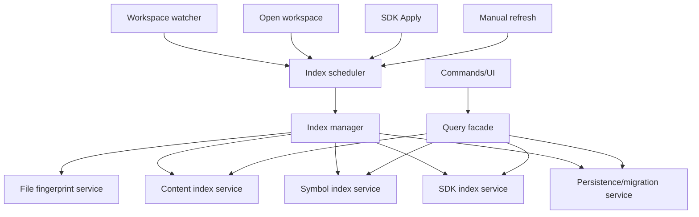

# ArkLine Indexing System Roadmap

## Purpose

This document archives the current indexing-system gap analysis and execution
plan. The goal is to evolve ArkLine from a set of direct indexing/search calls
into a maintainable IDE-style indexing platform with scheduling, persistence,
query facades, diagnostics, and SDK-aware semantic results.

## Mainstream IDE Patterns Reviewed

### JetBrains IDEs

JetBrains separates file-content indexes from declaration-oriented stub indexes.
File-based indexes map content-derived keys to files, while stub indexes store
compact externally visible declarations for PSI lookup. Indexing runs in the
background, and index-dependent features are restricted during "dumb mode" until
indexes are ready. JetBrains also emphasizes index versions, deterministic
file-content indexers, compact stub serialization, and diagnostics for indexing
performance.

References:

- https://plugins.jetbrains.com/docs/intellij/indexing-and-psi-stubs.html
- https://plugins.jetbrains.com/docs/intellij/file-based-indexes.html
- https://plugins.jetbrains.com/docs/intellij/stub-indexes.html

### VS Code

VS Code keeps editing responsive by routing workspace changes through file
watchers and delegating language-aware functionality to language services. Its
extension API exposes file-system watchers with create/change/delete events, and
the editor separates UI commands from provider/query implementations.

References:

- https://code.visualstudio.com/api/references/vscode-api#FileSystemWatcher
- https://code.visualstudio.com/docs/editing/codebasics

### Eclipse JDT

Eclipse JDT exposes a search package around indexed Java model elements and
workspace search scopes. The important pattern is a dedicated search layer above
the model/index data, rather than callers walking files directly.

Reference:

- https://help.eclipse.org/latest/topic/org.eclipse.jdt.doc.isv/reference/api/org/eclipse/jdt/core/search/package-summary.html

### Zoekt / Sourcegraph-Style Code Search

Zoekt is optimized for source-code search using trigram indexing, regexp
matching, symbol-aware ranking, repository-scale indexing, and API/server
separation. For ArkLine, the relevant pattern is using specialized text-search
indexes for content search instead of relying only on line scans or simple SQL
`LIKE` queries.

Reference:

- https://github.com/sourcegraph/zoekt

## Current ArkLine Indexing Status

Implemented foundations:

- Workspace scan with exclusions for dependency/generated/cache paths.
- In-memory workspace catalog with persisted JSON and SQLite state.
- Structured SQLite tables for files and symbols.
- FTS5-backed content index with line-level previews and context.
- Incremental content index updates for added/removed/changed paths.
- Lightweight ArkTS symbol extraction for class-like declarations and methods.
- Incremental symbol updates for changed/added/removed paths.
- Search Everywhere over files/classes/symbols with source-aware ranking.
- UTF-8-safe global text search summary handling.
- Basic ArkTS keyword completion additions.
- Central scheduler and task state machine for priority, generation, cancellation,
  superseding, resumable chunks, and task-status publication.
- Durable file fingerprint table and service for unchanged/changed/deleted path
  classification across refreshes.
- Readiness-aware query facade for Search Everywhere, global text search,
  definition, usages, file symbols, and completion envelopes.
- SDK/API symbols are persisted as active-SDK-scoped search, completion, and
  navigation candidates.
- Index diagnostics, health, repair, and explain services expose queue state,
  layer readiness, parser failures, unresolved imports, SDK counts, and recent
  unified index events.

Known remaining architectural weakness:

- Some older compatibility wrappers still call lower-level services directly.
- Search scaling still needs regex literal prefiltering, streaming delivery, and
  richer large-result ranking policy.
- SDK indexing captures useful API declarations and members, but still needs
  deeper ArkUI signature/overload metadata and versioned invalidation polish.
- Diagnostics are available, but the roadmap needs to keep closing gaps between
  backend explain data and the most actionable UI affordances.

## Gap Analysis

### 1. Scheduling

Current:

- `workspace_index_scheduler_service` owns task priority, coalescing, path
  dedupe, and bounded draining.
- `workspace_index_state_machine_service` owns task lifecycle transitions,
  terminal-state protection, cancellation, superseding, and stale-generation
  rejection.
- Manager and worker services publish running, queued, terminal, and stalled
  status projections.

Missing:

- More mature retry/backoff policy for repeated failures.
- More user-facing explanation for paused/deferred background work.
- Longer-running real-project scheduler telemetry beyond the current gates.

### 2. File Fingerprints

Current:

- `workspace_file_fingerprint_service` persists file metadata and classifies
  unchanged, changed, and deleted paths.
- Manager refresh paths use fingerprints to skip unchanged watcher updates.
- Current file readiness and explain services use fingerprint rows when
  describing missing or stale index state.

Missing:

- Optional content hashes for metadata-collision hardening on selected files.
- More explicit stale-row repair reporting after interrupted writes.
- Version-by-layer freshness metadata for future index format upgrades.

### 3. Index Schema and Migrations

Current:

- Tables are created opportunistically.
- Some JSON compatibility remains.

Missing:

- Explicit schema version table.
- Migration functions per version.
- Rebuild triggers for incompatible content/symbol/SDK index versions.
- Per-index freshness metadata.

### 4. Query Facade

Current:

- `workspace_index_query_service` centralizes quick open, Search Everywhere,
  scoped file/class/symbol/API lookup, and content search entry points.
- Search Everywhere now includes indexed SDK/API candidates through the query
  facade.
- `workspace_index_facade_service` and focused facade services route definition,
  usages, completion, file-symbol, Search Everywhere, and text-search queries
  through readiness and explain envelopes.

Missing:

- Remaining UI polish for Double Shift category tabs and result grouping.
- Stronger policy documentation for when each facade may fall back to legacy
  language-service or same-file behavior.

### 5. Semantic and SDK Indexing

Current:

- SDK configuration enables semantic worker behavior.
- SDK symbols are persisted as indexed search entities.
- SDK Apply triggers SDK symbol indexing and Search Everywhere can return
  SDK/API candidates.
- SDK API cache, scan-plan, persistence, active-SDK scoping, and diagnostics are
  covered by dedicated services and tests.
- Definition and completion facades can resolve active SDK API and member
  candidates.

Missing:

- ArkUI component/property/method signature index.
- Deeper overload/signature metadata and documentation text extraction.
- More complete declaration targets for every SDK source layout variant.
- More visible SDK invalidation and rebuild explanation in UI.

### 6. Content Search Scaling

Current:

- SQLite line table plus FTS5.
- Regex and whole-word still rely on fallback scan path.

Missing:

- Regex prefilter using extracted literal tokens or trigram-like candidates.
- Pagination/streaming of search results.
- Cancellation for long searches.
- Large-file and generated-file policies in index metadata.
- Better ranking using recent files, file type, path proximity, and symbol
  context.

### 7. Diagnostics

Current:

- Tests prove behavior, but runtime diagnostics are limited.
- Diagnostics, health, repair, file readiness, and query explain services are
  implemented and surfaced through command/UI paths.
- Recent unified index events, task timeline, queue pressure, parser failures,
  unresolved imports, SDK metadata, and schema counts are inspectable.

Missing:

- Tighter visual hierarchy for diagnostics when multiple repair actions exist.
- One-click collection/export of index health evidence for bug reports.
- More timeline sampling for slow files and repeated retries.

## Target Architecture



Ownership rules:

- Watcher and commands schedule tasks; they do not perform indexing directly.
- Index manager executes tasks and updates status.
- Content/symbol/SDK services own index data for their domain.
- Query facade owns query composition and fallback behavior.
- Persistence service owns schema creation, migration, and structured restore.

## Execution Plan

### Phase 1: Index Scheduler Skeleton

Goal:

- Introduce the scheduling layer without changing user-visible behavior.

Tasks:

- Add `workspace_index_scheduler_service`.
- Define:
  - `WorkspaceIndexTask`
  - `WorkspaceIndexTaskKind`
  - `WorkspaceIndexTaskPriority`
  - generation id
  - reason string
  - changed paths
- Implement:
  - coalesce changed-path tasks by root
  - dedupe paths
  - sort by priority
  - drain ready tasks
- Add tests:
  - changed paths are merged
  - duplicate paths are removed
  - user-blocking tasks drain before background tasks
  - different roots remain separate

Acceptance:

- No behavior change in existing indexing.
- Scheduler service file under 500 lines.
- Full Rust tests pass.

### Phase 2: Index Manager Entry Point

Goal:

- Stop direct watcher-to-runtime indexing calls.

Tasks:

- Add `workspace_index_manager_service`.
- Manager owns scheduler and `WorkspaceIndexRuntime`.
- Expose:
  - `open_workspace_index(root)`
  - `refresh_workspace_index(root)`
  - `schedule_changed_paths(root, paths)`
  - `drain_index_tasks()`
- Move watcher callback to schedule changed paths.
- Keep execution synchronous initially to avoid thread complexity.

Acceptance:

- Watcher calls manager, not runtime directly.
- Existing open/refresh behavior remains unchanged.
- Tests prove watcher events are coalesced before execution.

### Phase 3: File Fingerprints

Goal:

- Avoid reindexing unchanged files.

Tasks:

- Add SQLite table `workspace_file_fingerprints`:
  - root_path
  - path
  - mtime_ms
  - size
  - optional hash
  - content_index_version
  - symbol_index_version
  - indexed_generation
- Add fingerprint service:
  - read current file metadata
  - compare to persisted fingerprint
  - mark changed/unchanged/deleted
  - update after successful indexing
- Use fingerprints in manager before scheduling content/symbol work.

Acceptance:

- Refresh unchanged workspace does not rebuild content/symbol rows.
- Changed file updates only its content/symbol rows.
- Deleted file removes rows.
- Startup restore can determine fresh/stale state.

### Phase 4: Query Facade

Goal:

- Centralize every index read path.

Tasks:

- Add `workspace_index_query_service`.
- Move from commands/runtime:
  - quick open query
  - Search Everywhere composition
  - text search query
  - symbol query
- Add freshness-aware behavior:
  - if index ready, use memory/SQLite
  - if stale/partial, return freshness metadata
  - if SDK needed but not ready, mark disabled/retryable

Acceptance:

- Commands no longer compose index queries directly.
- Search Everywhere and global search behavior unchanged.
- Tests cover ready/stale/partial freshness.

### Phase 5: SDK Index

Goal:

- Make system APIs searchable, completable, and navigable.

Tasks:

- Add `workspace_sdk_index_service`.
- Parse/index SDK declarations:
  - classes
  - methods
  - properties
  - ArkUI components
  - decorators
  - overload/signature metadata
- Persist SDK index keyed by:
  - sdk path
  - sdk version
  - index schema version
- Trigger SDK index task after settings Apply.
- Add Search Everywhere SDK/API source.

Acceptance:

- Searching `Text`, `Column`, `width`, or SDK class names returns SDK/API
  candidates.
- Jump-to-definition for indexed SDK APIs resolves without relying only on
  same-file fallback.
- SDK apply status blocks SDK-dependent jump until ready.

Current progress:

- SDK Apply now routes through the index manager task path.
- SDK task results are queryable as status-bar-ready task statuses.

### Phase 6: Diagnostics and UI State

Goal:

- Make indexing transparent and debuggable.

Tasks:

- Add diagnostics command:
  - index status
  - generation
  - file count
  - content row count
  - symbol count
  - SDK symbol count
  - last errors
- Add rebuild/clear-cache commands.
- Add UI status surface:
  - indexing
  - partial
  - ready
  - SDK indexing
  - SDK failed

Acceptance:

- User can inspect why search/jump did not return a result.
- Rebuild Index clears and rebuilds structured SQLite indexes.
- Status bar reflects long-running index state.

Current progress:

- Diagnostics, rebuild, and clear-cache commands are present.
- Status bar can show SDK API index readiness and symbol count.

### Phase 7: Advanced Search Scaling

Goal:

- Make global search behave well on large projects.

Tasks:

- Add regex prefilter:
  - extract literal tokens
  - query FTS/trigram-like candidates
  - run regex only on candidates
- Add pagination and cancellation.
- Add search result streaming to UI.
- Add ranking signals:
  - active/open files
  - recent files
  - path depth
  - declaration proximity
  - exact/case/camel-case match

Acceptance:

- Regex search does not scan every file when literals exist.
- UI can cancel long searches.
- First page returns quickly on large workspace fixture.

## Implementation Order

Recommended sequence:

1. Scheduler skeleton.
2. Manager entry point with synchronous drain.
3. File fingerprint table and service.
4. Query facade.
5. SDK index service.
6. Diagnostics commands/UI.
7. Advanced search scaling.

Do not start SDK index before scheduler and fingerprinting are in place. SDK
indexing will otherwise introduce another direct-call path and make cache
freshness harder to reason about.

## Verification Matrix

Every phase must pass:

```bash
cargo test --manifest-path src-tauri/Cargo.toml
pnpm --dir semantic-worker test -- completion
pnpm exec vitest run tests/frontend/workspace-index-store.test.ts tests/frontend/app-shell.test.tsx --testNamePattern "Search Everywhere with class symbol|workspace index store"
pnpm build
```

Additional phase gates:

- Scheduler: unit tests for coalescing, dedupe, priority, generation.
- Fingerprints: unchanged files skip content/symbol writes.
- Query facade: ready/stale/partial fallback tests.
- SDK index: real SDK fixture tests for component/property/system API lookup.
- Diagnostics: command tests for counts and failure reporting.
