# Device Log System Implementation Plan

> **For agentic workers:** REQUIRED SUB-SKILL: Use superpowers:subagent-driven-development (recommended) or superpowers:executing-plans to implement this plan task-by-task. Steps use checkbox (`- [ ]`) syntax for tracking.

**Goal:** Build an IDE-grade Device Log system that can ingest high-volume device logs without UI jank, preserve logs beyond the visible viewport, support regex and structured filtering, and provide Studio-like reading and diagnostic workflows.

**Architecture:** Split the log path into ingestion, durable buffering, query/indexing, and virtualized presentation. The backend owns stream reading, batching, persistence, and query execution; the frontend owns filter controls, tail-follow behavior, row virtualization, and inspection UI.

**Tech Stack:** Tauri Rust services, `hdc hilog`, append-only segment files, SQLite metadata, React, TypeScript, Vitest, Rust unit tests.

---

## Current Baseline

- Backend has `src-tauri/src/services/device_log_service.rs` for hdc process lifecycle.
- Backend has `src-tauri/src/services/device_log_stream_service.rs` for batch flushing by line count or interval.
- Frontend has `src/components/layout/DeviceHiLogPanel.tsx` for HiLog controls, filtering, and virtualized rendering.
- Frontend store is `src/features/device-log/device-log-store.ts`.
- Parser/filter models live in `src/features/device-log/device-log-parser.ts`, `src/features/device-log/device-log-filter.ts`, and `src/features/device-log/device-log-model.ts`.
- Existing tests:
  - `tests/frontend/device-log-domain.test.ts`
  - `tests/frontend/device-log-tool-window.test.tsx`
  - Rust tests inside `src-tauri/src/services/device_log_service.rs`
  - Rust tests inside `src-tauri/src/services/device_log_stream_service.rs`

## Target Architecture

```mermaid
flowchart LR
  HDC["hdc hilog / faultloggerd"] --> Reader["Rust reader thread"]
  Reader --> Batcher["Batcher: lines or interval"]
  Batcher --> Spool["Append-only segment buffer"]
  Spool --> Meta["SQLite metadata index"]
  Meta --> Query["Query engine"]
  Spool --> Query
  Query --> Api["Tauri query/window API"]
  Api --> UiStore["Frontend query state"]
  UiStore --> VirtualView["Virtualized log view"]
  VirtualView --> Inspector["Log inspector/actions"]
```



## File Structure

- Create `src-tauri/src/models/device_log_query.rs`
  - Query request/response structs for log windows, filters, stats, and export.
- Create `src-tauri/src/services/device_log_segment_service.rs`
  - Append-only segment writer and reader.
- Create `src-tauri/src/services/device_log_metadata_service.rs`
  - SQLite schema, inserts, range lookup, structured indexes.
- Create `src-tauri/src/services/device_log_query_service.rs`
  - Query planner and executor over metadata plus raw segment slices.
- Create `src-tauri/src/services/device_log_runtime_service.rs`
  - Own stream state, buffer state, backpressure counters, and cleanup.
- Modify `src-tauri/src/services/device_log_service.rs`
  - Keep public commands thin and delegate to runtime/query services.
- Modify `src-tauri/src/lib.rs`
  - Register new modules and managed runtime state.
- Modify `src-tauri/src/commands/device_log.rs`
  - Add query/window/stats/export commands.
- Modify `src/features/workspace/workspace-api-contract.ts`
  - Add Device Log query APIs.
- Modify `src/features/workspace/workspace-default-runtime-api.ts`
  - Wire Tauri invokes and demo fallback.
- Create `src/features/device-log/device-log-query.ts`
  - Frontend query request builder, range defaults, and regex validation helpers.
- Create `src/features/device-log/device-log-view-model.ts`
  - Derive UI row models, highlight ranges, tail/follow status.
- Modify `src/components/layout/DeviceHiLogPanel.tsx`
  - Move from local all-entry filtering to backend window queries.
- Create `src/components/layout/DeviceLogInspector.tsx`
  - Show raw log, parsed fields, copy/isolate actions.
- Modify `src/styles/app.css`
  - Stable log row, filter bar, inspector, and status styles.
- Add tests in `src-tauri/src/services/*_tests.rs`
  - Segment persistence, query execution, metadata indexes, backpressure.
- Add tests in `tests/frontend/device-log-*.test.tsx`
  - Query controls, virtual view behavior, inspector actions.

## Phase 1: Stabilize Ingestion and Runtime State

### Task 1: Define Runtime Stats and Backpressure Model

**Files:**
- Create: `src-tauri/src/models/device_log_query.rs`
- Modify: `src-tauri/src/lib.rs`

- [ ] **Step 1: Write Rust model tests**

Add a test module in `src-tauri/src/models/device_log_query.rs`:

```rust
#[cfg(test)]
mod tests {
    use super::*;

    #[test]
    fn default_stats_report_zero_loss_and_idle_pressure() {
        let stats = DeviceLogRuntimeStats::default();

        assert_eq!(stats.ingested_lines, 0);
        assert_eq!(stats.dropped_lines, 0);
        assert_eq!(stats.backpressure_state, "idle");
    }
}
```

- [ ] **Step 2: Run the model test and verify it fails**

Run:

```bash
cargo test --manifest-path src-tauri/Cargo.toml device_log_query
```

Expected: fail because `DeviceLogRuntimeStats` does not exist.

- [ ] **Step 3: Add the models**

Create `src-tauri/src/models/device_log_query.rs`:

```rust
use serde::{Deserialize, Serialize};

#[derive(Debug, Clone, Serialize, Deserialize, PartialEq, Eq)]
pub struct DeviceLogRuntimeStats {
    pub stream_id: String,
    pub device_id: String,
    pub ingested_lines: u64,
    pub persisted_lines: u64,
    pub dropped_lines: u64,
    pub pending_batches: usize,
    pub buffer_bytes: u64,
    pub backpressure_state: String,
    pub last_error: Option<String>,
}

impl Default for DeviceLogRuntimeStats {
    fn default() -> Self {
        Self {
            stream_id: String::new(),
            device_id: String::new(),
            ingested_lines: 0,
            persisted_lines: 0,
            dropped_lines: 0,
            pending_batches: 0,
            buffer_bytes: 0,
            backpressure_state: "idle".to_string(),
            last_error: None,
        }
    }
}
```

Register it in `src-tauri/src/lib.rs`:

```rust
mod models {
    pub mod device_log;
    pub mod device_log_query;
    pub mod diagnostics;
    pub mod language;
    pub mod terminal;
    pub mod workspace;
    pub mod workspace_edit;
    pub mod workspace_index_layer;
}
```

- [ ] **Step 4: Run the model test**

Run:

```bash
cargo test --manifest-path src-tauri/Cargo.toml device_log_query
```

Expected: pass.

### Task 2: Replace Fire-and-Forget Reader With Runtime-Owned Counters

**Files:**
- Create: `src-tauri/src/services/device_log_runtime_service.rs`
- Modify: `src-tauri/src/services/device_log_stream_service.rs`
- Test: `src-tauri/src/services/device_log_runtime_service.rs`

- [ ] **Step 1: Write runtime counter tests**

Create tests in `src-tauri/src/services/device_log_runtime_service.rs`:

```rust
#[cfg(test)]
mod tests {
    use super::*;

    #[test]
    fn records_ingested_and_persisted_lines_without_drop() {
        let runtime = DeviceLogRuntimeState::default();

        runtime.record_ingested("stream-1", "device-1", 25);
        runtime.record_persisted("stream-1", 25, 1024);

        let stats = runtime.stats_for("stream-1").expect("stats");
        assert_eq!(stats.ingested_lines, 25);
        assert_eq!(stats.persisted_lines, 25);
        assert_eq!(stats.dropped_lines, 0);
        assert_eq!(stats.buffer_bytes, 1024);
    }
}
```

- [ ] **Step 2: Run test and verify red**

Run:

```bash
cargo test --manifest-path src-tauri/Cargo.toml device_log_runtime_service
```

Expected: fail because runtime service does not exist.

- [ ] **Step 3: Implement runtime state**

Add a focused runtime service with `Mutex<HashMap<String, DeviceLogRuntimeStats>>`. Methods:

```rust
pub fn record_ingested(&self, stream_id: &str, device_id: &str, lines: u64)
pub fn record_persisted(&self, stream_id: &str, lines: u64, bytes: u64)
pub fn record_drop(&self, stream_id: &str, lines: u64, reason: &str)
pub fn stats_for(&self, stream_id: &str) -> Option<DeviceLogRuntimeStats>
```

Keep every method deterministic and side-effect free beyond stats mutation.

- [ ] **Step 4: Register module**

Add to `src-tauri/src/lib.rs`:

```rust
pub mod device_log_runtime_service;
```

- [ ] **Step 5: Run tests**

Run:

```bash
cargo test --manifest-path src-tauri/Cargo.toml device_log_runtime_service
```

Expected: pass.

## Phase 2: Durable Append-Only Buffer

### Task 3: Add Segment Writer

**Files:**
- Create: `src-tauri/src/services/device_log_segment_service.rs`
- Test: same file

- [ ] **Step 1: Write segment append/read test**

```rust
#[cfg(test)]
mod tests {
    use super::*;

    #[test]
    fn appends_lines_and_reads_by_offset() {
        let temp = tempfile::tempdir().expect("tempdir");
        let mut writer = DeviceLogSegmentWriter::open(temp.path(), "stream-1").expect("writer");

        let first = writer.append_lines(&["one".to_string(), "two".to_string()]).expect("first");
        let second = writer.append_lines(&["three".to_string()]).expect("second");

        assert_eq!(read_segment_lines(temp.path(), "stream-1", first.offset, first.bytes).unwrap(), vec!["one", "two"]);
        assert_eq!(read_segment_lines(temp.path(), "stream-1", second.offset, second.bytes).unwrap(), vec!["three"]);
    }
}
```

- [ ] **Step 2: Run and verify red**

Run:

```bash
cargo test --manifest-path src-tauri/Cargo.toml device_log_segment_service
```

Expected: fail because segment service does not exist.

- [ ] **Step 3: Implement append-only segment service**

Use newline-delimited UTF-8 text for phase 1:

```rust
pub struct SegmentWriteReceipt {
    pub offset: u64,
    pub bytes: u64,
    pub line_count: u64,
}

pub struct DeviceLogSegmentWriter {
    file: std::fs::File,
    offset: u64,
}
```

Behavior:
- Create directory if missing.
- File path: `<root>/<stream_id>.logseg`.
- `append_lines` writes each line plus `\n`.
- Return byte offset and byte count.
- `read_segment_lines` reads exact byte range and splits by lines.

- [ ] **Step 4: Run tests**

Run:

```bash
cargo test --manifest-path src-tauri/Cargo.toml device_log_segment_service
```

Expected: pass.

### Task 4: Persist Segment Metadata in SQLite

**Files:**
- Create: `src-tauri/src/services/device_log_metadata_service.rs`
- Test: same file

- [ ] **Step 1: Write SQLite metadata test**

```rust
#[cfg(test)]
mod tests {
    use super::*;

    #[test]
    fn stores_line_offsets_and_queries_recent_range() {
        let temp = tempfile::tempdir().expect("tempdir");
        let store = DeviceLogMetadataStore::open(temp.path()).expect("store");

        store.insert_batch(&DeviceLogMetadataBatch {
            stream_id: "stream-1".to_string(),
            device_id: "device-1".to_string(),
            first_seq: 1,
            received_at_ms: 10_000,
            line_count: 2,
            segment_file: "stream-1.logseg".to_string(),
            segment_offset: 0,
            segment_bytes: 8,
            levels: vec!["info".to_string(), "error".to_string()],
        }).expect("insert");

        let rows = store.query_range("stream-1", 9_000, 11_000, 100).expect("rows");
        assert_eq!(rows.len(), 1);
        assert_eq!(rows[0].line_count, 2);
    }
}
```

- [ ] **Step 2: Run and verify red**

Run:

```bash
cargo test --manifest-path src-tauri/Cargo.toml device_log_metadata_service
```

Expected: fail because metadata service does not exist.

- [ ] **Step 3: Implement metadata store**

Create SQLite file `<buffer_root>/device-log.sqlite`.

Schema:

```sql
create table if not exists device_log_batches (
  id integer primary key,
  stream_id text not null,
  device_id text not null,
  first_seq integer not null,
  received_at_ms integer not null,
  line_count integer not null,
  segment_file text not null,
  segment_offset integer not null,
  segment_bytes integer not null,
  levels_json text not null
);
create index if not exists idx_device_log_stream_time
  on device_log_batches(stream_id, received_at_ms);
```

Use `rusqlite` already present in the project. Store `levels_json` as JSON string for now.

- [ ] **Step 4: Run tests**

Run:

```bash
cargo test --manifest-path src-tauri/Cargo.toml device_log_metadata_service
```

Expected: pass.

## Phase 3: Backend Query Engine

### Task 5: Define Query Request and Response

**Files:**
- Modify: `src-tauri/src/models/device_log_query.rs`

- [ ] **Step 1: Add serialization test**

```rust
#[test]
fn query_request_defaults_to_recent_one_minute() {
    let request = DeviceLogQueryRequest::recent("stream-1");

    assert_eq!(request.stream_id, "stream-1");
    assert_eq!(request.time_range_ms, 60_000);
    assert_eq!(request.limit, 500);
}
```

- [ ] **Step 2: Run and verify red**

Run:

```bash
cargo test --manifest-path src-tauri/Cargo.toml query_request_defaults_to_recent_one_minute
```

Expected: fail because `DeviceLogQueryRequest` does not exist.

- [ ] **Step 3: Implement query models**

Add:

```rust
#[derive(Debug, Clone, Serialize, Deserialize, PartialEq, Eq)]
pub struct DeviceLogQueryRequest {
    pub stream_id: String,
    pub query: String,
    pub regex: bool,
    pub match_case: bool,
    pub levels: Vec<String>,
    pub process: String,
    pub domain: String,
    pub tag: String,
    pub time_range_ms: u64,
    pub limit: usize,
    pub cursor_seq: Option<u64>,
}

#[derive(Debug, Clone, Serialize, Deserialize, PartialEq, Eq)]
pub struct DeviceLogQueryRow {
    pub seq: u64,
    pub received_at_ms: u64,
    pub raw: String,
    pub timestamp: Option<String>,
    pub level: String,
    pub pid: Option<u64>,
    pub tid: Option<u64>,
    pub process: String,
    pub domain: String,
    pub tag: String,
    pub message: String,
}

#[derive(Debug, Clone, Serialize, Deserialize, PartialEq, Eq)]
pub struct DeviceLogQueryResponse {
    pub rows: Vec<DeviceLogQueryRow>,
    pub total_candidates: usize,
    pub scanned_lines: usize,
    pub truncated: bool,
    pub query_ms: u64,
}
```

- [ ] **Step 4: Run tests**

Run:

```bash
cargo test --manifest-path src-tauri/Cargo.toml device_log_query
```

Expected: pass.

### Task 6: Query Recent Logs With Text and Regex

**Files:**
- Create: `src-tauri/src/services/device_log_query_service.rs`
- Test: same file

- [ ] **Step 1: Write query engine tests**

```rust
#[cfg(test)]
mod tests {
    use super::*;

    #[test]
    fn query_matches_recent_regex_without_scanning_old_batches() {
        let rows = vec![
            make_row(1, 1_000, "old width log"),
            make_row(2, 70_000, "fresh width log"),
        ];
        let request = DeviceLogQueryRequest {
            stream_id: "stream-1".to_string(),
            query: "fresh.*log".to_string(),
            regex: true,
            match_case: false,
            levels: vec![],
            process: String::new(),
            domain: String::new(),
            tag: String::new(),
            time_range_ms: 60_000,
            limit: 100,
            cursor_seq: None,
        };

        let response = filter_rows_for_test(rows, &request, 70_001).expect("response");

        assert_eq!(response.rows.len(), 1);
        assert_eq!(response.rows[0].message, "fresh width log");
    }
}
```

- [ ] **Step 2: Run and verify red**

Run:

```bash
cargo test --manifest-path src-tauri/Cargo.toml device_log_query_service
```

Expected: fail because query service does not exist.

- [ ] **Step 3: Implement query filter**

Implement:
- plain search with case-insensitive default.
- regex search with compile error returned as `Err(String)`.
- time cutoff: `now_ms - request.time_range_ms`.
- structured filters before message regex.
- hard limit on returned rows.

- [ ] **Step 4: Run tests**

Run:

```bash
cargo test --manifest-path src-tauri/Cargo.toml device_log_query_service
```

Expected: pass.

## Phase 4: Tauri API and Frontend Integration

### Task 7: Add Backend Commands

**Files:**
- Modify: `src-tauri/src/commands/device_log.rs`
- Modify: `src-tauri/src/lib.rs`
- Test: command-level Rust tests where existing command tests are located.

- [ ] **Step 1: Add command signatures**

Commands:

```rust
#[tauri::command]
pub fn query_device_logs(
    state: tauri::State<'_, DeviceLogRuntime>,
    request: DeviceLogQueryRequest,
) -> Result<DeviceLogQueryResponse, String>

#[tauri::command]
pub fn get_device_log_stats(
    state: tauri::State<'_, DeviceLogRuntime>,
    stream_id: String,
) -> Result<DeviceLogRuntimeStats, String>
```

- [ ] **Step 2: Register invoke handlers**

Add both commands to the Tauri invoke handler list in `src-tauri/src/lib.rs`.

- [ ] **Step 3: Run build**

Run:

```bash
cargo test --manifest-path src-tauri/Cargo.toml device_log
```

Expected: existing and new command tests pass.

### Task 8: Add Workspace API Types

**Files:**
- Modify: `src/features/workspace/workspace-api-contract.ts`
- Modify: `src/features/workspace/workspace-default-runtime-api.ts`
- Test: `tests/frontend/workspace-api.test.ts`

- [ ] **Step 1: Write frontend API test**

Add a test asserting demo fallback returns an empty query response:

```ts
it("queries device logs through the workspace API contract", async () => {
  const response = await defaultWorkspaceApi.queryDeviceLogs({
    streamId: "demo-device-log-stream",
    query: "width",
    regex: false,
    matchCase: false,
    levels: [],
    process: "",
    domain: "",
    tag: "",
    timeRangeMs: 60_000,
    limit: 500,
    cursorSeq: null,
  });

  expect(response.rows).toEqual([]);
  expect(response.truncated).toBe(false);
});
```

- [ ] **Step 2: Run and verify red**

Run:

```bash
pnpm exec vitest run tests/frontend/workspace-api.test.ts -t "queries device logs"
```

Expected: fail because API does not exist.

- [ ] **Step 3: Implement contract and runtime invoke**

Add TypeScript types mirroring Rust models:

```ts
export type DeviceLogQueryRequest = {
  streamId: string;
  query: string;
  regex: boolean;
  matchCase: boolean;
  levels: string[];
  process: string;
  domain: string;
  tag: string;
  timeRangeMs: number;
  limit: number;
  cursorSeq: number | null;
};
```

Wire runtime:

```ts
queryDeviceLogs(request) {
  return invoke("query_device_logs", { request });
}
```

- [ ] **Step 4: Run test**

Run:

```bash
pnpm exec vitest run tests/frontend/workspace-api.test.ts -t "queries device logs"
```

Expected: pass.

### Task 9: Move HiLog Panel to Backend Window Queries

**Files:**
- Modify: `src/components/layout/DeviceHiLogPanel.tsx`
- Create: `src/features/device-log/device-log-query.ts`
- Test: `tests/frontend/device-log-tool-window.test.tsx`

- [ ] **Step 1: Write UI query behavior test**

Add:

```ts
it("queries the backend using the recent one-minute range when the filter changes", async () => {
  const queryDeviceLogs = vi.fn(async () => ({
    rows: [],
    totalCandidates: 0,
    scannedLines: 0,
    truncated: false,
    queryMs: 2,
  }));
  const api = { ...createWorkspaceApi(), queryDeviceLogs };
  const user = userEvent.setup();

  render(<AppShell workspaceApi={api} />);
  await user.click(screen.getByRole("tab", { name: "Device Log" }));
  await user.click(screen.getByRole("tab", { name: "HiLog" }));
  const panel = await screen.findByLabelText("Device Log Panel");

  fireEvent.change(within(panel).getByLabelText("Filter device logs"), { target: { value: "width" } });

  await waitFor(() => expect(queryDeviceLogs).toHaveBeenCalled());
  expect(queryDeviceLogs.mock.calls.at(-1)?.[0]).toMatchObject({
    query: "width",
    timeRangeMs: 60_000,
    regex: false,
  });
});
```

- [ ] **Step 2: Run and verify red**

Run:

```bash
pnpm exec vitest run tests/frontend/device-log-tool-window.test.tsx -t "queries the backend"
```

Expected: fail because the panel still filters local store state.

- [ ] **Step 3: Implement query request builder**

Create `src/features/device-log/device-log-query.ts`:

```ts
import type { DeviceLogFilterState } from "@/features/device-log/device-log-model";
import type { DeviceLogQueryRequest } from "@/features/workspace/workspace-api";

export const DEFAULT_DEVICE_LOG_QUERY_RANGE_MS = 60_000;
export const DEFAULT_DEVICE_LOG_QUERY_LIMIT = 500;

export function buildDeviceLogQueryRequest(streamId: string, filter: DeviceLogFilterState): DeviceLogQueryRequest {
  return {
    streamId,
    query: filter.query,
    regex: filter.regex,
    matchCase: filter.matchCase,
    levels: filter.levels,
    process: filter.process,
    domain: filter.domain,
    tag: filter.tag,
    timeRangeMs: DEFAULT_DEVICE_LOG_QUERY_RANGE_MS,
    limit: DEFAULT_DEVICE_LOG_QUERY_LIMIT,
    cursorSeq: null,
  };
}
```

- [ ] **Step 4: Use backend query in `DeviceHiLogPanel`**

Behavior:
- When `filter.query` or structured filters change, debounce 150ms.
- If no active `streamId`, keep using live tail rows already received.
- If query is active and stream is active, call `workspaceApi.queryDeviceLogs`.
- Render query rows through the same virtual log view.
- Keep invalid regex error local before calling backend.

- [ ] **Step 5: Run UI tests**

Run:

```bash
pnpm exec vitest run tests/frontend/device-log-tool-window.test.tsx
```

Expected: pass.

## Phase 5: Reading Experience and Inspector

### Task 10: Add Log Inspector

**Files:**
- Create: `src/components/layout/DeviceLogInspector.tsx`
- Modify: `src/components/layout/DeviceHiLogPanel.tsx`
- Test: `tests/frontend/device-log-tool-window.test.tsx`

- [ ] **Step 1: Write selection/inspector test**

```ts
it("opens an inspector with raw log details for the selected row", async () => {
  const user = userEvent.setup();
  render(<AppShell workspaceApi={createWorkspaceApi()} />);
  await user.click(screen.getByRole("tab", { name: "Device Log" }));
  await user.click(screen.getByRole("tab", { name: "HiLog" }));
  const panel = await screen.findByLabelText("Device Log Panel");

  fireEvent(panel, new CustomEvent("arkline-device-log-lines", {
    bubbles: true,
    detail: {
      deviceId: "device-1",
      lines: ["06-25 15:21:48.123  1234  5678 E C03F00/AppTag com.example.demo: boom"],
    },
  }));

  await user.click(await within(panel).findByText("boom"));

  expect(within(panel).getByRole("region", { name: "Log Inspector" })).toBeVisible();
  expect(within(panel).getByText("com.example.demo")).toBeVisible();
  expect(within(panel).getByText(/06-25 15:21:48.123/u)).toBeVisible();
});
```

- [ ] **Step 2: Run and verify red**

Run:

```bash
pnpm exec vitest run tests/frontend/device-log-tool-window.test.tsx -t "opens an inspector"
```

Expected: fail because inspector does not exist.

- [ ] **Step 3: Implement inspector**

Inspector sections:
- Summary: level, tag, process, pid/tid.
- Raw: full original line.
- Actions:
  - Copy Raw
  - Filter Tag
  - Filter Process
  - Clear Selection

- [ ] **Step 4: Run test**

Run:

```bash
pnpm exec vitest run tests/frontend/device-log-tool-window.test.tsx -t "opens an inspector"
```

Expected: pass.

### Task 11: Add Highlighted Matches

**Files:**
- Create: `src/features/device-log/device-log-view-model.ts`
- Modify: `src/components/layout/DeviceHiLogPanel.tsx`
- Test: `tests/frontend/device-log-domain.test.ts`

- [ ] **Step 1: Write highlight test**

```ts
it("marks case-insensitive query highlights in log messages", () => {
  const ranges = findDeviceLogHighlights("Width changed width", {
    query: "width",
    regex: false,
    matchCase: false,
  });

  expect(ranges).toEqual([{ start: 0, end: 5 }, { start: 14, end: 19 }]);
});
```

- [ ] **Step 2: Run and verify red**

Run:

```bash
pnpm exec vitest run tests/frontend/device-log-domain.test.ts -t "highlights"
```

Expected: fail because highlighter does not exist.

- [ ] **Step 3: Implement highlighter**

Implement plain and regex modes. Regex mode:
- catch invalid regex and return `[]`.
- cap highlights to 100 ranges per row.
- ignore zero-width regex matches.

- [ ] **Step 4: Render highlights**

In row message rendering, split message into text spans and `<mark className="device-log-tool-window__match">`.

- [ ] **Step 5: Run tests**

Run:

```bash
pnpm exec vitest run tests/frontend/device-log-domain.test.ts tests/frontend/device-log-tool-window.test.tsx
```

Expected: pass.

## Phase 6: Operational Features

### Task 12: Add Log System Status Strip

**Files:**
- Modify: `src/components/layout/DeviceHiLogPanel.tsx`
- Modify: `src/styles/app.css`
- Test: `tests/frontend/device-log-tool-window.test.tsx`

- [ ] **Step 1: Write status test**

```ts
it("shows log throughput and drop count in the status strip", async () => {
  const api = {
    ...createWorkspaceApi(),
    getDeviceLogStats: async () => ({
      streamId: "stream-1",
      deviceId: "device-1",
      ingestedLines: 1200,
      persistedLines: 1200,
      droppedLines: 0,
      pendingBatches: 0,
      bufferBytes: 4096,
      backpressureState: "idle",
      lastError: null,
    }),
  };

  render(<AppShell workspaceApi={api} />);
  await userEvent.click(screen.getByRole("tab", { name: "Device Log" }));

  expect(await screen.findByText(/1,200 lines/u)).toBeVisible();
  expect(screen.getByText(/0 dropped/u)).toBeVisible();
});
```

- [ ] **Step 2: Implement polling**

Poll stats every 1s while stream is running. Stop polling when stream stops or tab unmounts.

- [ ] **Step 3: Run tests**

Run:

```bash
pnpm exec vitest run tests/frontend/device-log-tool-window.test.tsx -t "status strip"
```

Expected: pass.

### Task 13: Add Export Filtered Logs

**Files:**
- Modify: `src-tauri/src/commands/device_log.rs`
- Modify: `src/features/workspace/workspace-api-contract.ts`
- Modify: `src/components/layout/DeviceHiLogPanel.tsx`
- Test: Rust command test and frontend action test.

- [ ] **Step 1: Define export command**

Command:

```rust
#[tauri::command]
pub fn export_device_logs(request: DeviceLogQueryRequest, output_path: String) -> Result<DeviceLogExportSummary, String>
```

- [ ] **Step 2: Backend behavior**

Use query engine with `limit = usize::MAX` but stream output to file in chunks. Do not allocate all rows in memory.

- [ ] **Step 3: UI behavior**

Add button:
- `Export`
- disabled when no stream/query source exists.
- writes current filter result.

- [ ] **Step 4: Tests**

Run:

```bash
cargo test --manifest-path src-tauri/Cargo.toml export_device_logs
pnpm exec vitest run tests/frontend/device-log-tool-window.test.tsx -t "Export"
```

Expected: pass.

## Performance Budgets

- Ingestion: handle at least 20,000 lines/minute without dropped lines.
- UI: render update no more than once per animation frame.
- Query default: recent 1 minute, return first 500 rows within 100ms for 100k buffered rows.
- Regex: invalid regex error in under 50ms; long-running regex query cancellable.
- Memory: frontend should not hold full stream history once backend query API is active.
- Files: every production code file touched by this plan stays below 500 lines.

## Verification Matrix

Run after each phase:

```bash
pnpm exec vitest run tests/frontend/device-log-domain.test.ts tests/frontend/device-log-tool-window.test.tsx
cargo test --manifest-path src-tauri/Cargo.toml device_log
git diff --check
```

Run before merging:

```bash
pnpm build
cargo test --manifest-path src-tauri/Cargo.toml device_log
cargo test --manifest-path src-tauri/Cargo.toml device_log_query
cargo test --manifest-path src-tauri/Cargo.toml device_log_segment
cargo test --manifest-path src-tauri/Cargo.toml device_log_metadata
```

## Rollout Strategy

1. Keep current live event path active while adding backend persistence.
2. Add query APIs behind the existing panel behavior.
3. Switch query-active mode to backend query first.
4. Switch all visible windows to backend query after stats show zero dropped lines.
5. Add export and inspector once the backend is the source of truth.

## Risks and Mitigations

- Regex over huge logs can freeze execution.
  - Mitigation: compile once, scan chunks, cap per-query runtime, add cancellation token.
- Segment files can grow indefinitely.
  - Mitigation: retention settings by size and time, default size cap with clear UI warning.
- SQLite insert per line is too slow.
  - Mitigation: insert per batch in transaction, store raw lines in segment file.
- UI can still jank if row heights vary.
  - Mitigation: fixed-height default rows; full raw text appears in inspector.
- Backend persistence can fail due disk permissions.
  - Mitigation: expose status strip error and fall back to memory-only buffer with warning.

## Long-Term Extensions

- Trigram index for fast text search across all buffered logs.
- Saved filter presets per project/device.
- Error aggregation and fault-log correlation.
- Source navigation from stack traces.
- Multi-device merged timeline.
- Log bookmarks and annotations.
- Remote log session replay.

## Progress Notes

### 2026-07-06: Recent-First Query and Live View Bound

- Backend log query now scans recent batches and recent lines first, then returns matching rows ordered by sequence for readable display. This prevents a limited query from being filled by stale matching lines when the stream is large.
- Frontend HiLog live view now uses a bounded 10,000-entry window. Older visible rows are counted as persisted history instead of being held indefinitely by React state.
- Query/filter mode still uses the backend recent one-minute query API when a stream is active, preserving the intended separation between durable log history and the visible live window.
- Verified with focused Rust regression for newest matching line preference and frontend regression for live-window eviction reporting.

### 2026-07-06: Query Pagination Cursor

- Device log query responses now include `nextCursorSeq`, and requests consume `cursorSeq` to continue scanning older matching rows.
- Cursor semantics are stable: the first query returns the newest matching page, sorted by sequence for display; the next query passes the first page's `nextCursorSeq` to fetch the next older page.
- This turns the query `limit` into a page size rather than a hard truncation boundary, which is required before adding Load More / export workflows.
- Verified with Rust pagination regression and TypeScript request-builder/API contract tests.

### 2026-07-06: Query Load Older UI

- HiLog query results now show a `Load Older` action when the backend returns `nextCursorSeq`.
- Loading older results sends the cursor back to the backend, prepends the older page, and removes the action once no more cursor is available.
- Pagination UI tests live in a separate focused test file so existing test files stay below the 500-line code limit.
- Verified with a React regression that checks request cursor usage, result merging, and button disappearance after the final page.

### 2026-07-06: Sparse Match Query Scan

- Backend log query no longer fetches only `limit * 20` metadata batches. It now scans metadata in bounded pages until the requested result page is full or the time window is exhausted.
- This fixes sparse-filter cases where many newer batches contain no match and the actual matching logs are older but still inside the query window.
- The query path still streams through segment batches page by page instead of loading all metadata and rows into memory at once.
- Verified with a Rust regression that inserts 70 newer non-matching batches ahead of an older matching batch and confirms the match is found.

### 2026-07-06: Query Core Module Split

- Split the device log query core into focused parser, matcher, response, and orchestration modules.
- `device_log_query_service.rs` now owns query orchestration and tests, while parsing/matching/response construction are reusable for future cancellation, timeout, and export paths.
- This reduced the largest query service file from the 489-line limit edge to 341 lines, restoring room for long-term evolution under the 500-line code rule.
- Public query API stayed unchanged and was verified against the same backend and frontend suites.

### 2026-07-06: Query Scan Budget

- Device log query requests now carry `scanBudgetLines`, defaulting to 100,000 lines from the frontend query builder.
- Backend queries stop after the budgeted number of text-filtered rows, return `budgetExceeded`, and provide `nextCursorSeq` so the user can continue with `Load Older` instead of blocking on a full-window scan.
- This bounds single-query work for large logs and complex filters while preserving the durable history and pagination model.
- Verified with a Rust regression that exhausts a two-line budget before any match and confirms the cursor is returned for continuation.

### 2026-07-06: Scan Budget UI Feedback

- HiLog query summaries now include `scan budget reached` when the backend stops early because of `scanBudgetLines`.
- Empty result pages can still show query summary and `Load Older` when a continuation cursor exists, so users are not trapped by a budgeted page that found no matches yet.
- Verified with a React regression that starts with an empty budget-limited page, clicks `Load Older`, and then renders the later matching row.

### 2026-07-06: Query Controller Hook Split

- Moved HiLog backend query state, debounced querying, budget summary formatting, and `Load Older` pagination into `useDeviceLogQueryController`.
- `DeviceHiLogPanel.tsx` dropped from 475 lines to 421 lines, leaving room for future UI work under the 500-line limit.
- The hook keeps query behavior unchanged while making cancellation, export, and query lifecycle diagnostics easier to add without bloating the panel.

### 2026-07-06: Query Generation Guard

- HiLog backend query state now tracks a query generation so stale async responses cannot update the current filter state.
- `Load Older` responses are ignored after the user changes the filter or query lifecycle resets, preventing older pages from a previous query from mixing into the visible results.
- This matches the IDE-style rule that background log/history work may finish late, but only the active query generation is allowed to render.
- Verified with a React regression that resolves an older `width` page after switching to a fresh `height` filter and confirms the stale row never appears.

### 2026-07-06: Follow-Tail Stability Regression

- Added a focused frontend regression for IDE-console-style tail following.
- The live log view stays on newest rows while following the tail, shows `Follow Tail` after the user scrolls away, and does not let incoming lines steal the viewport.
- Clicking `Follow Tail` returns the view to the newest rows, preserving the expected Studio/IDE log-console behavior during sustained log flow.

### 2026-07-06: Device Log Test Isolation Hardening

- Hardened device-log query tests with an atomic temp-directory suffix so parallel Rust tests do not collide on SQLite files.
- This removes false `readonly database` / `DirectoryNotEmpty` failures and makes the log persistence/query regression suite trustworthy for future high-throughput work.

### 2026-07-06: Runtime Backpressure Watermark

- Runtime stats now track pending log batches as an explicit backpressure signal instead of only reporting drops after failure.
- Backpressure state transitions are deterministic: `idle` with no pending batches, `buffering` under normal backlog, `saturated` at high backlog, and `dropping` on persistence failure.
- Durable stream persistence marks each emitted batch as queued before writing and drains the pending count after persist/drop, so the existing stats API can surface pressure without changing the UI polling contract.
- HiLog status now shows pending batch count when pressure exists, e.g. `20,000 lines · 0 dropped · 42 pending · saturated`.

### 2026-07-06: Bounded Reader Queue

- Replaced the unbounded reader-to-batcher channel with a bounded `sync_channel` so log floods cannot grow memory without limit.
- The queue applies blocking backpressure when full instead of dropping or truncating lines, pushing pressure back toward the `hdc` stdout pipe while preserving line order.
- Added a regression that fills a small queue, confirms overflow reports `Full`, drains one line, and verifies the next line is accepted and delivered in order.
- This establishes the queue primitive needed before moving persistence into a dedicated writer worker with explicit high/low watermarks.

### 2026-07-06: Bounded Writer Worker

- Added a dedicated writer worker sink between the batcher/UI event path and durable segment/metadata persistence.
- The batcher thread now enqueues write jobs into a bounded writer queue and can emit UI batches without synchronously waiting for SQLite/segment writes under normal load.
- Writer queue enqueue records ingested lines and pending batches immediately; the background worker drains pending state when durable persistence succeeds or fails.
- The writer queue blocks when full, preserving the no-drop/no-truncate contract while applying pressure at the persistence boundary.
- Verified with a regression that two batches enqueue through the worker, persist in order, and report zero dropped lines with pending batches drained.

### 2026-07-06: Synthetic High-Volume Gate

- Added a 20,000-line synthetic log regression that writes 400 batches through the bounded writer worker.
- The gate verifies `ingested_lines == persisted_lines == 20,000`, `dropped_lines == 0`, and `pending_batches == 0` after the worker drains.
- The same test queries the persisted buffer with a regex targeting the newest ten records and verifies ordered results from `pressure target 19990` through `pressure target 19999`.
- This is the first automated high-throughput correctness gate; future performance work should add latency budgets and UI render-frame sampling on top of it.

### 2026-07-06: Writer Worker Module Split

- Split durable persistence and the bounded writer worker out of `device_log_stream_service.rs` into `device_log_writer_worker_service.rs`.
- The stream service now owns only reader, line queue, batching, and UI event emission, while the writer worker service owns segment writes, metadata writes, queue drain, and high-volume persistence tests.
- This keeps the reader/batcher file small enough for future tail-follow and emission work, and leaves the writer worker file with room for latency budgets and high/low watermark policies.

### 2026-07-06: UI-First Batch Delivery

- Changed batch delivery order so UI event emission happens before durable persistence enqueue.
- This prevents slow disk/SQLite writes or a saturated writer queue from delaying the currently available log batch from reaching the frontend.
- Durable persistence still runs immediately after emission through the bounded writer worker, so the no-drop/no-truncate contract remains enforced by backpressure on subsequent batches.
- Added an ordering regression that records `emit` before `persist`, locking the intended console responsiveness behavior.

### 2026-07-06: Frontend RAF Coalescing Gate

- Added a frontend burst regression for HiLog event ingestion.
- The test sends 100 log events before the next animation frame and verifies only one `requestAnimationFrame` flush is scheduled.
- After the frame callback runs, the latest burst line is visible and the virtualized list renders far fewer DOM rows than the 500 incoming lines.
- This locks the console-style behavior needed for sustained log flow: many incoming batches should become one React state update per frame, not one update per event.

### 2026-07-06: Writer Latency Metrics

- Runtime stats now expose `lastWriteMs` and `slowWriteBatches` so persistence latency is visible instead of inferred from pending backlog alone.
- Writer worker persistence records elapsed time for each durable segment/metadata write and increments slow batch count when a write crosses the runtime threshold.
- HiLog status shows write latency only when it is non-zero, and slow batch count only when slow batches exist, keeping the normal idle display compact.
- The 20,000-line synthetic gate now also verifies the writer latency metric stays bounded and slow batches do not dominate the run.

### 2026-07-06: Backpressure Watermark Hysteresis

- Backpressure state now uses explicit high/low watermarks instead of a single threshold.
- The writer queue enters `saturated` at 100 pending batches and remains saturated until pending batches drop below 25, preventing status flicker around the high-water boundary.
- A runtime regression verifies the queue stays `saturated` at 99 pending batches after crossing high water, then returns to `buffering` only after draining to 24.

### 2026-07-06: Query Time Window Normalization

- Added a dedicated query time-range layer before log metadata queries reach SQLite.
- Query `nowMs` values above SQLite's signed integer domain are clamped instead of wrapping into negative timestamps.
- Unbounded or extreme `timeRangeMs` requests now normalize to a safe `[0, i64::MAX]` window, preserving search correctness for pathological API inputs and future export/debug tooling.
- A backend integration regression confirms a persisted log remains queryable when both `nowMs` and `timeRangeMs` are extreme `u64` values.

### 2026-07-06: Query Core Test Split and Soft Deadline

- Moved backend query regressions into a dedicated test module, reducing the query orchestration file from 481 lines to 233 lines and keeping future query work below the 500-line code limit.
- Added a backend query deadline layer with a 120ms soft budget for persisted log scans.
- When the deadline is reached, the query returns the rows scanned so far plus `budgetExceeded` and `nextCursorSeq`, so the UI can continue with the existing `Load Older` flow instead of blocking on a full-window scan.
- A deterministic regression uses a zero-duration deadline to prove timed queries return a continuation cursor after the first scanned candidate.

### 2026-07-06: Query Stop Reason Contract

- Device log query responses now expose an explicit `stopReason`: `complete`, `limit`, `scanBudget`, or `deadline`.
- The backend no longer forces all partial-query outcomes through an ambiguous boolean; `budgetExceeded` remains as a compatibility signal for existing UI flows.
- HiLog query summaries now distinguish deadline stops from scan-budget stops, showing `time budget reached` when the 120ms soft deadline is hit.
- Rust regressions cover scan-budget, deadline, and limit reasons; a frontend regression verifies deadline-specific summary text while preserving the `Load Older` continuation path.

### 2026-07-06: Plain Text Match-Case Correctness

- Fixed backend plain-text log query matching so `matchCase=true` compares against the raw log line instead of a lowercased copy.
- Default plain-text search remains case-insensitive, and regex matching continues to use the regex builder's case-sensitivity setting.
- Added matcher regressions for exact-case hits, case-sensitive misses, and default case-insensitive hits.

### 2026-07-06: Structured Filter Match-Case Consistency

- Fixed backend persisted-log filtering for `process`, `domain`, and `tag` so it honors `matchCase` the same way the frontend live filter does.
- Case-insensitive structured matching remains the default, preserving the common IDE log-console search behavior.
- Added backend regressions for case-sensitive structured misses and default case-insensitive structured hits.

### 2026-07-06: SQLite Metadata Write-Path Hardening

- Device log metadata SQLite connections now enable WAL mode so persisted-log queries and continuous writer batches can coexist with less lock contention.
- Added a 5s busy timeout to absorb short writer/query lock overlap instead of immediately failing under bursty log traffic.
- Set `synchronous=normal`, matching the common WAL-mode tradeoff used for high-throughput local caches where append-only segment files remain the source payload.
- Added a backend regression that verifies WAL, busy timeout, and synchronous mode are applied when the metadata store opens.

### 2026-07-06: Batch Level Metadata Summary

- Writer persistence now records a compact per-batch level summary in SQLite metadata instead of leaving `levels` empty.
- Added a focused level-summary service that maps HiLog level markers to ArkLine levels and keeps unique levels in first-seen order.
- This prepares the query engine for batch-level pruning when users filter by level, reducing unnecessary segment reads and regex work under large log histories.
- Added regressions for metadata persistence of info/error summaries and unknown fallback lines.

### 2026-07-06: Batch Level Query Pruning

- Persisted log queries now use batch-level metadata to skip segment reads when a level filter cannot match that batch.
- The pruning is conservative: old metadata with empty `levels` is still scanned so historical buffers remain queryable.
- A backend regression verifies an `error` query skips a newer `info` batch and counts only the candidate lines from the matching batch.
- This reduces IO and regex work for common filtered log-console workflows such as error-only inspection during high-volume streams.

### 2026-07-06: Query Pruning Module Split

- Extracted batch metadata pruning into `device_log_query_pruning_service` instead of keeping pruning decisions inside the query orchestration loop.
- The pruning service owns the conservative rules for metadata-based skips: no request level filter means keep, empty legacy metadata means keep, and only a known no-overlap level summary is skipped.
- This keeps the query orchestrator focused on paging, segment reads, scanning, and deadlines, while leaving a clear home for future process/domain/tag metadata pruning.
- Added focused pruning service regressions plus the existing persisted-query integration gate.

### 2026-07-06: Device Log Regression Isolation

- Hardened remaining device-log segment and writer-worker test temp directories with process id plus atomic counters.
- This prevents parallel Rust test cleanup from colliding on nanosecond-only temporary paths, matching the earlier query/metadata isolation pattern.
- Stable high-throughput gates are part of the logging architecture: loss, truncation, ordering, regex queryability, and backpressure behavior need repeatable evidence before further optimization.

### 2026-07-06: Lossy Stream Reader

- Replaced `BufRead::lines().map_while(Result::ok)` with a byte-oriented line reader for device log stdout.
- Invalid UTF-8 bytes are now decoded with replacement characters instead of stopping the reader thread and silently dropping all subsequent log lines.
- The reader also preserves a final line without a trailing newline, covering the common process-exit tail case.
- Added regressions for invalid UTF-8 continuation and trailing-newline-free final lines.

### 2026-07-06: Stream Lifecycle Module Split

- Extracted device-log start/stop stream lifecycle into `device_log_stream_lifecycle_service`.
- `device_log_service` now keeps device discovery, fault-log normalization, runtime state access, and shared helpers, reducing it from the 500-line edge and leaving room for lifecycle hardening.
- This gives future work a focused place for graceful stop, child process wait/reap, stream status transitions, stderr handling, and shutdown cleanup without bloating fault-log parsing code.
- Existing command entrypoints and stream behavior remain unchanged and are covered by the device-log backend and frontend tool-window regressions.

### 2026-07-06: Stream Stop Reap

- Hardened device-log stream stop so the child process is always waited after kill, preventing unreaped `hdc hilog` children during repeated connect/disconnect cycles.
- The stop helper first handles already-exited children, then kills running children and reaps their exit status.
- Added lifecycle regressions for both running-child kill/reap and already-exited child handling.
- This keeps the lifecycle layer aligned with long-running IDE log-console expectations: stopping a stream must release OS resources, not just remove UI state.

### 2026-07-06: Stream Stderr Diagnostics

- Added a dedicated stderr reader for `hdc hilog` streams so command/device failures update runtime `lastError` instead of being silently ignored.
- Stderr diagnostics are kept separate from stdout log payloads: they do not increment dropped-line counters and do not pollute the persisted log stream.
- The stderr reader uses byte-oriented lossy decoding, preserving later diagnostics even when the tool emits invalid UTF-8 bytes.
- Lifecycle startup now captures both stdout and stderr, wiring stdout to the high-throughput log reader and stderr to runtime diagnostics.

### 2026-07-06: Stream Lifecycle State

- Runtime stats now expose a backend-owned `streamStatus` field instead of leaving stream state only in frontend component state.
- The lifecycle layer records `running`, `stopping`, and `stopped`; stderr diagnostics move the stream to `error` while preserving the last diagnostic message.
- HiLog stats UI includes the backend stream status alongside throughput, dropped-line, pending-batch, write-latency, and backpressure metrics.
- This gives future reconnect/retry/shutdown work a single authoritative lifecycle signal for distinguishing empty output from stopped or failed streams.

### 2026-07-06: Runtime Status Driven Controls

- HiLog now consumes backend `streamStatus` as an interaction signal, not just a text metric.
- When runtime stats report `error`, the panel switches from `Running`/`Stop` to `error`/`Start`, surfaces `lastError`, and stops polling the failed stream.
- When runtime stats report `stopped`, the panel returns to the idle control state.
- This aligns the log window with IDE-grade behavior: users can tell the difference between a live empty stream, a stopped stream, and a failed stream without guessing.

### 2026-07-06: HiLog Toolbar Split

- Extracted HiLog stream status, Start/Stop/Clear controls, and runtime stats formatting into `DeviceLogStreamToolbar`.
- Reduced `DeviceHiLogPanel` from 450 to 428 lines while keeping behavior covered by existing runtime-stats and tool-window regressions.
- This keeps the main panel focused on stream lifecycle, live entry buffering, query orchestration, and virtualization, leaving room for retry/reconnect work without crossing the 500-line limit.

### 2026-07-06: HiLog Entries View Split

- Extracted virtualized log row rendering, Load Older, Follow Tail, row selection, and highlighted message rendering into `DeviceLogEntriesView`.
- Reduced `DeviceHiLogPanel` from 428 to 385 lines while keeping the entries view itself at 125 lines.
- This separates high-throughput rendering concerns from stream lifecycle and query orchestration, making future reconnect/loss diagnostics easier to add without destabilizing row virtualization.

### 2026-07-06: Manual Stream Retry Foundation

- HiLog now presents a dedicated `Retry` action when runtime stats move a stream into `error`.
- Retrying clears stale runtime stats before starting the next stream, preventing an old backend error sample from immediately forcing the new stream back into `error`.
- Device changes and explicit stops also clear runtime stats so status text cannot leak across stream identities.
- This creates a safe recovery path before adding automatic reconnect with backoff.

### 2026-07-06: Stream Exit Monitor Foundation

- Runtime stats now have an explicit stream-exit recording path: successful natural exits become `stopped`, while nonzero exits become `error` with a readable `hdc hilog exited: ...` diagnostic.
- The lifecycle layer starts a lightweight exit monitor for each `hdc hilog` child process.
- The monitor uses non-blocking `try_wait` polling instead of owning a blocking `wait`, so explicit Stop can still kill and reap the process without being stuck behind a monitor thread.
- This closes an important observability gap where a dead log process could previously leave the UI looking like a live empty stream, and it prepares the next phase: bounded automatic reconnect with visible retry countdown.

### 2026-07-06: Automatic Retry Countdown

- HiLog now schedules a short automatic retry when backend runtime stats report `streamStatus=error`.
- The toolbar shows `Auto retry in Ns` while preserving the manual `Retry` action, so users can either wait for recovery or retry immediately.
- Pending retry timers are cleared on manual retry, explicit stop, device switch, and component teardown to avoid stale reconnect attempts against the wrong device.
- The implementation keeps retry conservative: a single visible delayed restart after a backend-owned error signal. Future phases can layer bounded exponential backoff and retry budgets on this foundation.

### 2026-07-06: Bounded Retry Backoff Policy

- Extracted retry timing into a focused frontend policy module instead of embedding retry constants directly in the HiLog panel.
- Automatic reconnect now follows a bounded backoff sequence: 2s, 4s, then 8s, and then stops retrying until the user intervenes.
- The retry budget is preserved across automatic restart attempts and resets only after a healthy backend `running` stats sample, manual retry success, explicit stop, or device switch.
- Added regressions for the pure retry policy and for the visible UI transition from `Auto retry in 2s` to `Auto retry in 4s` after consecutive backend failures.
- Remaining maturity work: expose retry budget/attempts through telemetry once the diagnostics panel is ready for log-stream health.

### 2026-07-06: Retry Exhaustion User State

- HiLog now surfaces retry-budget exhaustion inside the log toolbar as `Auto retry stopped` instead of only writing a transient shell status message.
- Once the 2s/4s/8s automatic attempts are spent, the stream remains in `error` with the manual `Retry` action visible and no further hidden reconnect attempts are scheduled.
- Manual Retry clears the exhausted marker and starts a new stream, giving users an explicit recovery action after persistent device or hdc failures.
- Added a regression that drives the full retry budget to exhaustion, verifies no extra automatic starts happen after exhaustion, and verifies manual Retry remains effective.
- Remaining maturity work: expose retry attempts through the diagnostics center.

### 2026-07-06: Auto Retry Hook Extraction

- Extracted automatic retry state, timers, countdown, budget reset, healthy reset, and exhaustion handling into `useDeviceLogAutoRetry`.
- `DeviceHiLogPanel` now consumes the retry controller instead of owning retry timers directly, reducing the panel from 451 to 421 lines and keeping retry logic independently testable.
- The retry hook accepts injectable retry delays, so budget/exhaustion regressions now run in milliseconds instead of waiting through the production 2s/4s/8s sequence.
- Added a focused hook regression for bounded retry, exhaustion, no extra hidden retry after exhaustion, and reset behavior.

### 2026-07-06: Auto Retry Pause Control

- HiLog now exposes `Pause Auto` while an automatic retry countdown is active, and `Resume Auto` while automatic retry is paused.
- Pausing clears the pending retry timer and shows `Auto retry paused`, preventing hidden reconnect attempts while the user investigates device or hdc instability.
- Resuming re-enables automatic retry without immediately reconnecting; manual `Retry` remains the explicit recovery action.
- Added hook and panel regressions for pause, no hidden retry while paused, resume, and manual retry after resume.

### 2026-07-06: Stats Poll Failure Visibility

- Runtime stats polling failures now become a visible recoverable stream error instead of leaving the toolbar stuck in `Running`.
- The frontend converts a failed `getDeviceLogStats` call into the same runtime-stats error shape used by backend stream failures, so the existing `error` state, `Retry` action, and bounded auto-retry path remain consistent.
- When stats polling fails, the panel also asks the backend to stop the old stream before recovery, reducing the chance of duplicate live `hdc hilog` processes during retry.
- The surfaced diagnostic preserves the thrown error message, allowing users to distinguish hdc stream failure from stats API failure.
- Added a regression for rejected stats polling to prevent future silent Promise rejections, misleading running-state UI, and orphaned stream ownership.

### 2026-07-06: Live View Pause / Resume

- HiLog now has a `Pause Live` control that freezes the visible live view while incoming log events continue to be buffered in the frontend store.
- While paused, the toolbar shows the number of pending live entries, making the backlog explicit instead of letting the user wonder whether logging stopped.
- `Resume Live` merges the pending entries back into the visible bounded live window and returns to follow-tail mode, preserving incoming lines without forcing constant scroll churn while the user is reading.
- Device switches clear the paused state so a frozen view cannot leak across devices.
- Added a regression that appends logs while paused, verifies they are hidden but counted, then resumes and verifies the buffered lines appear.

### 2026-07-06: Live Buffer Hook Extraction

- Extracted live log event buffering, animation-frame coalescing, device filtering, pause/resume pending state, and reset/refresh signals into `useDeviceLogLiveBuffer`.
- `DeviceHiLogPanel` now delegates live ingestion state to the hook and focuses on stream lifecycle, query orchestration, filtering, and presentation wiring.
- The extraction reduced `DeviceHiLogPanel` from 478 to 441 lines, preserving room under the 500-line limit for future diagnostics and log-reading refinements.
- Added focused hook regressions for burst coalescing, other-device filtering, paused pending buffering, and resume reveal behavior.

### 2026-07-06: Query Pending Visibility

- Backend log queries now expose a frontend `querying` state while the debounced query is in flight.
- The log list shows `Searching logs...` during long-running filtered queries, including the empty-result state where the UI previously looked idle.
- The state clears on query success, query failure, reset, or inactive query mode, preserving stale-result protection while making slow searches observable.
- Added a regression that holds the backend query promise open, verifies the searching state, resolves the query, and verifies the result replaces the pending message.

### 2026-07-06: Render-Path Regex Guardrail

- Frontend regex highlighting now skips very long log messages instead of running JavaScript regex matching in the render path.
- Local frontend regex filtering uses the same guardrail for immediate preview results, avoiding expensive JavaScript regex work before the backend query response arrives.
- This guardrail protects the UI thread from expensive display-only highlighting work while preserving backend regex query behavior.
- Plain text highlighting still works on long messages because it uses bounded substring scanning rather than arbitrary regex execution.
- Added domain regressions that verify long-message regex highlights and local regex preview filtering are skipped.

### 2026-07-06: Paged Raw Query Export Core

- Added a backend export formatter that turns `DeviceLogQueryResponse` rows into newline-delimited raw log text without reformatting structured fields.
- Added an `export_device_logs` Tauri command and `WorkspaceApi.exportDeviceLogs` runtime binding, reusing the existing query request shape so export semantics match filtered search semantics.
- Export now follows `next_cursor_seq` until no further page is available, so it does not silently stop at the first query page.
- Cursor-stall protection returns an explicit error instead of risking an infinite export loop.
- This establishes a no-truncation export path for filtered query results before adding file-picker UI or long-running full-history export jobs.
- Added Rust coverage for preserving raw row text, paged export, cursor-stall detection, and frontend API coverage for invoking the desktop export command.

### 2026-07-06: Streaming Export Core

- Paged export now writes each query page directly into a `Write` target instead of requiring the core export loop to accumulate one large string.
- The existing string-returning Tauri command is now a thin compatibility wrapper over the writer-based core.
- This prepares the next maturity step: exporting very large filtered logs directly to a file path without duplicating pagination, cursor safety, or raw-line formatting logic.
- Added Rust coverage for writer-based export across multiple query pages.

### 2026-07-06: Direct File Export Core

- Added a file-backed export path that streams paged query results into a `BufWriter<File>` instead of returning a large string to the frontend.
- Added the `export_device_logs_to_file` Tauri command and `WorkspaceApi.exportDeviceLogsToFile` runtime binding for future save-dialog UI wiring.
- The file export path reuses the same pagination, cursor-stall protection, and raw-line formatting as the string and writer export paths.
- Parent export directories are created when needed, matching the project's existing persisted-file service pattern.
- Added Rust coverage for writing paged results to a file path and frontend coverage for invoking the desktop file export command.

### 2026-07-06: Filtered Export UI Wiring

- Added a HiLog toolbar `Export` action that uses the current stream and filter state to export matching logs.
- Added a workspace-level save-file picker abstraction over Tauri dialog `save()`, keeping Device Log UI independent from desktop plugin imports.
- The UI calls `exportDeviceLogsToFile` after the user selects a path, so large exports stay on the backend file-writing path instead of returning a large string to React state.
- Cancelled save dialogs now leave the backend untouched and surface `Device log export cancelled` in the existing Device Log status area.
- Added frontend coverage for successful filtered export, cancelled export, and the default Tauri save-dialog runtime binding.

### 2026-07-06: Structured Filter Bar

- Extracted HiLog filter controls into `DeviceLogFilterBar`, keeping the main panel below the 500-line limit as filtering grows.
- Added IDE-style level chips for Error/Warn/Info/Debug/Fatal plus Process, Domain, and Tag fields.
- Fixed query activation so structured-only filters now use the backend query API instead of only filtering the small frontend live window.
- This closes the UI/API gap where the backend accepted structured filters but the user could not reliably drive them from the tool window.
- Added frontend coverage for level-only backend queries and process/tag structured queries without text search.

### 2026-07-06: PID Filter Completion

- Added `pid` to the backend `DeviceLogQueryRequest`, TypeScript workspace API contract, and frontend query request builder.
- Backend structured matching now supports exact PID filtering, preserving the existing empty-filter behavior when PID is blank.
- HiLog filter controls now expose a PID field and a `Clear Filters` action so users can quickly reset complex structured filters during live debugging.
- Added Rust coverage for exact PID matching and frontend coverage that PID-only filtering reaches the backend query API.

### 2026-07-06: Inspector Action Completion

- HiLog Inspector now supports `Copy Raw`, matching the original reading-experience plan and common IDE log-console behavior.
- Inspector quick filters now include PID and Domain in addition to Tag and Process.
- PID/Domain quick filters feed the same structured filter state as the toolbar, so they reuse backend query pagination instead of local-only filtering.
- Added frontend coverage for raw-line clipboard copy, PID quick filtering, and Domain quick filtering.

### 2026-07-06: PID Filter Validation

- PID filters now validate locally before any backend log query or export can run.
- Invalid PID input shows the inline filter error `PID filter must be a number`, matching the existing regex-error flow instead of failing silently.
- The shared `compileDeviceLogFilter` gate keeps live filtering, backend querying, and export behavior consistent.
- Added domain and UI coverage proving invalid PID filters are rejected and do not trigger backend queries.

### 2026-07-06: Runtime Severity Counters

- Runtime stats now track persisted warn, error, and fatal line counts in the backend writer path.
- The HiLog status strip shows non-zero severity counters as `E`, `W`, and `F` next to total ingested lines, so error pressure is visible during high-volume streams without frontend rescanning.
- Severity counters update only after successful durable persistence, avoiding false counts when segment or metadata writes fail.
- Added Rust coverage for severity counting, runtime aggregation, and writer integration, plus frontend coverage for the status-strip summary.

### 2026-07-06: Cursor Metadata Pruning

- Persisted log queries now skip metadata batches whose first sequence is at or after the pagination cursor before opening the segment file.
- This makes `Load Older` avoid repeatedly reading fully newer batches that were already outside the requested page, reducing IO and scan work on large log histories.
- The pruning stays conservative: batches that may contain both newer and older cursor rows are still read and filtered row-by-row.
- Added Rust coverage for complete cursor-pruned batches, partial cursor-overlap batches, and query-level candidate counts proving skipped batches are not read.

### 2026-07-06: Segment Read Guardrail

- Segment reads now reject a single metadata range larger than 16 MiB before allocating the read buffer.
- This protects query/export paths from corrupted or abnormal metadata that could otherwise trigger a large allocation on the Rust side.
- The guard is intentionally above normal batch sizes, so regular high-throughput batches are unaffected while damaged ranges fail with a clear error.
- Added Rust coverage proving oversized segment reads return `Device log segment read exceeds maximum batch bytes` before attempting a large range read.

### 2026-07-06: Query Page Size Cap

- Backend log queries now normalize requested page size before scanning, with a hard cap of 2,000 rows per response.
- This protects Tauri, export, and future CLI callers from accidentally requesting an unbounded result page that would grow memory on the query path.
- A requested limit of zero is normalized to one row, keeping pagination semantics valid and avoiding ambiguous empty pages.
- Added Rust coverage for limit normalization and a query-level regression proving oversized limits return a capped page with a continuation cursor.

### 2026-07-06: In-Memory Text Export Guard

- The legacy string-returning log export path now writes through a bounded in-memory writer capped at 8 MiB.
- When the cap is exceeded, export fails with `Device log text export exceeds maximum in-memory bytes; use file export` instead of returning a huge string to the frontend.
- Direct file export remains streaming and is not subject to the text-export memory cap, preserving the no-truncation path for large log exports.
- Added Rust coverage for both the guarded string export and large-row file export behavior.

### 2026-07-06: Atomic-Style File Export

- Direct file export now writes to a temporary sibling path first and replaces the target only after all pages are written and flushed.
- If a later page query fails, the temporary file is removed and any existing target file is preserved unchanged.
- This prevents failed exports from leaving a plausible-looking partial `.log` file on disk while keeping the successful export path streaming.
- Added Rust coverage proving an existing target survives a mid-export query failure.

### 2026-07-06: Runtime Storage Visibility

- The HiLog runtime status strip now surfaces persisted log storage size from the existing `bufferBytes` metric.
- Storage is formatted in human-readable binary units, for example `1 MiB persisted`, so large live sessions expose pressure before export or query latency becomes mysterious.
- The change consumes the existing runtime stats contract instead of introducing a new polling path, keeping observability lightweight and compatible with later storage-health diagnostics.
- Added frontend coverage proving persisted bytes appear alongside severity counters, dropped lines, pending batches, write latency, and backpressure state.

### 2026-07-06: Storage Health Core

- Added a backend storage-health service that summarizes the persisted Device Log root without reading log contents.
- The health model reports root path, total bytes, segment file count, segment bytes, metadata bytes, metadata batch count, metadata line count, and oldest/newest metadata timestamps.
- Added the `get_device_log_storage_health` Tauri command plus WorkspaceApi runtime binding so future UI, diagnostics, and CLI surfaces can consume the same storage contract.
- Missing storage roots now report a zero-value health payload instead of creating files or surfacing a confusing error.
- Added Rust coverage for populated and missing storage roots, plus frontend API coverage for invoking the desktop command.

### 2026-07-06: Storage Pressure Classification

- Storage health now classifies persisted Device Log pressure as `healthy`, `warning`, or `critical` based on total persisted bytes.
- The health payload also includes a recommended action: `none`, `reviewRetention`, or `clearOldLogs`.
- The initial thresholds are conservative built-in defaults: warning at 512 MiB and critical at 2 GiB; later settings work can make these user-configurable without changing the health contract.
- This stage remains read-only: it does not delete or compact files yet, but it gives the UI and diagnostics layer a clear signal for retention prompts.
- Added Rust coverage for healthy empty/populated storage and critical sparse-segment storage without writing large real log files.

### 2026-07-06: Manual Storage Clear Action

- Added an explicit backend clear action for persisted Device Log storage, matching the `clearOldLogs` recommendation from storage health.
- The clear action removes only known log storage files: `*.logseg`, `device-log.sqlite`, `device-log.sqlite-wal`, and `device-log.sqlite-shm`.
- Unrelated files in the storage directory are preserved, avoiding broad directory deletion.
- Runtime command handling refuses to clear storage while a Device Log stream is active, preventing concurrent writer/delete races.
- Added Rust coverage for selective file removal and frontend API coverage for the `clear_device_log_storage` command.

### 2026-07-06: Storage Health Toolbar UI

- HiLog now loads Device Log storage health when the panel is active and surfaces pressure in the toolbar, for example `Storage critical · 3 GiB`.
- Added a `Clear Storage` toolbar action backed by the explicit storage-clear command.
- The UI disables storage clearing while a stream is starting, running, or stopping, matching the backend writer/delete protection.
- Storage health and clearing state live in a focused hook so the HiLog panel stays below the 500-line file limit.
- Added frontend coverage proving storage pressure is visible and the toolbar clear action calls the workspace API.

### 2026-07-06: Storage Health Live Refresh

- Storage health now refreshes every 15 seconds while the HiLog panel is active.
- The refresh path remains lightweight: it calls the storage-health summary API and never reads log contents.
- The interval is disposed when the panel becomes inactive or unmounts, avoiding background polling from closed tool windows.
- Added frontend coverage proving toolbar pressure updates from `healthy` to `critical` while the panel stays open.

### 2026-07-06: Storage Health Polling Backpressure

- Storage health refresh now uses a single-flight guard, so interval polling cannot start overlapping health requests when the storage API is slow.
- This keeps the diagnostics path from adding UI pressure during high-volume log sessions or slow disk states.
- Missing storage-health API support still clears the health state immediately and does not enter the in-flight guard.
- Added frontend coverage proving repeated timer ticks do not issue additional health requests while one request is still running.

### 2026-07-06: Foreground Query Backpressure

- Device Log foreground filtering now uses a single-flight query controller with latest-request coalescing.
- When a backend log query is still running, additional filter changes replace the queued request instead of starting overlapping backend queries.
- Stale responses still cannot update the visible result set because generation checks remain in place.
- This matches mature IDE console behavior: typing stays responsive while the query engine drains one foreground query at a time.
- Added frontend coverage proving a slow query blocks overlapping requests and then runs only the latest filter after the first query completes.

### 2026-07-06: Live Render Flush Fallback

- Live log rendering still prefers `requestAnimationFrame` coalescing, so foreground streams update at most once per frame.
- Added a 100ms fallback flush timer for cases where animation frames are delayed or throttled.
- The fallback prevents pending live batches from accumulating indefinitely while preserving line ordering and store capacity behavior.
- The normal animation-frame path cancels the fallback timer once it flushes, avoiding duplicate renders.
- Added hook coverage proving live batches become visible even when the animation-frame callback does not run.

### 2026-07-06: Query Budget Continuation Feedback

- Query summaries now include an explicit continuation hint when a deadline or scan-budget stop still has a pagination cursor.
- The UI now tells the user `Load Older to continue` instead of only reporting that a time or scan budget was reached.
- This keeps high-volume regex/content searches explainable: budget stops are no longer indistinguishable from hard failures or empty results.
- Added frontend coverage for both deadline and scan-budget continuation feedback.

### 2026-07-06: Query Continuation Diagnostics Contract

- Backend query responses now expose `continuationCursorSeq` and `continuationReason` in addition to the existing pagination cursor.
- Continuation reasons distinguish `none`, `limit`, `scanBudget`, and `deadline`, giving diagnostics and UI code a stable contract instead of inferring from several fields.
- The frontend query summary now prefers the explicit continuation cursor/reason when present and falls back to legacy fields for existing mocks.
- Added Rust coverage for budget-stopped and complete responses at the response-construction layer.

### 2026-07-06: Regex Query Cost Guard

- Backend Device Log regex queries now reject patterns longer than 2,048 characters before regex compilation.
- Regex compilation uses a 1 MiB compiled-size limit so unusually broad patterns fail fast instead of consuming query resources.
- Regex guard failures return actionable messages such as `Device log regex is too long; use 2048 characters or fewer`.
- The HiLog query UI surfaces backend regex guard errors in the existing query summary area, so users can recover by narrowing the pattern.
- Added Rust matcher coverage for accepted normal regex patterns and rejected oversized regex patterns, plus frontend coverage for displaying backend regex guard errors.

### 2026-07-06: Foreground Query Cooperative Cancellation

- Foreground `query_device_logs` requests now use latest-wins query generations per stream.
- A newer foreground query supersedes an older running query; the older backend scan checks a cooperative cancellation token during batch and row scanning.
- Cancelled queries return the explicit `cancelled` stop/continuation reason instead of looking like an empty result or generic failure.
- Export paths still use the non-cancellable query API so long-running exports are not interrupted by interactive filter typing.
- The HiLog query summary can surface `superseded by a newer query` for diagnostics, while normal stale-generation UI guards still prevent old results from replacing fresh input.
- Added Rust coverage proving a superseded query stops before scanning the full window, plus frontend coverage for the cancelled query summary.

### 2026-07-06: Query Generation Boundary

- Extracted foreground query generation ownership into `DeviceLogQueryGenerationRegistry`.
- The runtime now receives a small cancellable query token instead of owning the generation map directly.
- This keeps `DeviceLogRuntime` focused on stream lifecycle, stats, storage, and command orchestration while preparing a clean seam for a future query worker/queue layer.
- Query generations remain isolated per stream: starting a new query on one device log stream does not cancel another stream's foreground query.
- Added Rust coverage for same-stream supersession and cross-stream isolation.

### 2026-07-06: Foreground Query Worker

- Added a dedicated `DeviceLogQueryWorker` for interactive foreground log queries.
- The Tauri `query_device_logs` path now submits work to the query worker instead of running scans directly in the command call path.
- Each submitted foreground query still receives a latest-wins token before entering the worker queue, so a newer query can cancel an older running query as soon as it is submitted.
- The worker serializes foreground scans, preventing overlapping expensive regex/content searches from competing with each other.
- Export paths remain outside this foreground worker so export pagination keeps its non-interactive, full-scan semantics.
- Added Rust coverage proving a blocked first query observes cancellation after a newer query is submitted and the newer query completes normally.

### 2026-07-06: Query Worker Observability

- Added `DeviceLogQueryWorkerStats` with `running`, `queued`, completed/cancelled/failed counts, last query duration, and last error.
- The foreground query worker now updates stats when jobs are queued, started, completed, cancelled, or failed.
- Added the `get_device_log_query_worker_stats` Tauri command and WorkspaceApi binding for diagnostics and UI surfaces.
- HiLog toolbar now surfaces query-worker pressure, for example `Query running · 1 queued · 2 cancelled · last 17ms`.
- The stats path is read-only and single-purpose: it observes foreground query scheduling without changing export or ingestion semantics.
- Added Rust worker coverage plus frontend API/UI coverage for the query-worker status surface.

### 2026-07-06: Query Worker Event History

- Added `DeviceLogQueryWorkerEvent` as the first durable event shape for Device Log query diagnostics.
- The foreground query worker now keeps a bounded in-memory history of the most recent 64 terminal query events.
- Each event records sequence, stream id, query text, terminal status, duration, and error text when present.
- The event write happens only when a query finishes, so it does not touch the high-volume line ingestion path.
- Added the `get_device_log_query_worker_events` Tauri command through the runtime, preparing the next diagnostics-center UI stage.
- Added Rust coverage proving successful and failed queries are visible in recent event history with terminal status and error details.

### 2026-07-06: Device Log Workspace API Boundary

- Extracted Device Log workspace API types into `workspace-device-log-api-types.ts`.
- This keeps `workspace-api-contract.ts` focused on the cross-tool API surface and gives the Device Log system room to evolve under the 500-line file limit.
- The new type boundary includes query request/response rows, runtime stats, query worker stats, query worker events, and storage health contracts.
- Added the frontend `getDeviceLogQueryWorkerEvents` runtime binding for the backend event-history command.
- Browser fallback returns an empty event history, keeping non-Tauri test/demo surfaces deterministic.
- Added frontend coverage proving both query worker stats and query worker event commands invoke the correct desktop APIs.

### 2026-07-06: Query Diagnostics Panel

- Added a lightweight HiLog Query Diagnostics panel backed by query worker event history.
- The panel shows the most recent foreground query events with terminal status, query text, duration, and error text.
- The UI remains read-only and compact: it does not pause ingestion, alter query scheduling, or touch the live log rendering path.
- Event polling uses a single-flight hook matching query worker stats polling, preventing overlapping diagnostics requests.
- This is the first user-visible layer of the Device Log observability system: users can now distinguish slow, cancelled, failed, and completed foreground queries.
- Added frontend coverage proving failed query events appear in the diagnostics region.

### 2026-07-06: Query Diagnostics Summary

- Added a compact summary row to the HiLog Query Diagnostics panel.
- The summary counts failed, cancelled, and slow foreground queries from the recent event history.
- The initial slow-query threshold is 250ms, matching interactive search expectations where longer foreground filters are worth surfacing.
- The summary is derived entirely from existing worker events, so it adds no backend work and does not affect ingestion, persistence, export, or query scheduling.
- Styling lives in the component-level diagnostics stylesheet rather than the global app stylesheet, preserving the long-term file-size boundary.
- Added frontend coverage for failed, cancelled, and slow query summary chips.

### 2026-07-06: Runtime Service Boundary Split

- Split device discovery into `device_log_hdc_service.rs`, including hdc path resolution and target parsing.
- Split fault log fetching and normalization into `device_fault_log_service.rs`.
- Reduced `device_log_service.rs` from a mixed command/runtime/parser module to a focused runtime orchestration service.
- This keeps the backend ready for retention, diagnostics, and configuration work without violating the 500-line file limit.
- Existing Tauri command names stay unchanged; only their service imports changed.
- Moved the existing hdc and fault log normalization tests with the extracted services and verified the targeted Rust suites.

### 2026-07-06: Retention Dry-Run Plan

- Added `DeviceLogRetentionPlan` and `DeviceLogRetentionCandidate` contracts.
- Added a read-only retention planner that scans persisted `.logseg` files, totals current bytes, and selects oldest segment candidates until storage would fall below a target byte budget.
- The planner is intentionally dry-run only: it does not delete files, mutate SQLite metadata, or touch running stream state.
- Exposed the plan through runtime, Tauri command `plan_device_log_retention`, and WorkspaceApi `planDeviceLogRetention`.
- This is the safe first half of automatic retention. The later execute step must separately guard active streams and metadata cleanup.
- Added Rust coverage proving the planner chooses oldest segments without deleting them, plus frontend API coverage for the desktop command.

### 2026-07-06: Retention Apply Guard

- Added `DeviceLogRetentionApplyResult` and a protected retention apply command.
- The apply path recalculates the retention plan from `targetBytes` and deletes only `.logseg` candidates produced by the planner.
- Runtime refuses to apply retention while any Device Log stream is active, preventing deletion of a currently written segment.
- Retention now removes SQLite batch metadata only for segment files that were actually deleted, keeping health summaries and later queries consistent with disk state.
- HiLog exposes a guarded `Apply Retention` toolbar action when storage health recommends cleanup; it uses the 512 MiB warning budget and refreshes health after completion.
- Split retention planning/apply into `device_log_retention_service.rs`, keeping storage health focused on inspection/clear and preserving the 500-line code-file limit.
- Added frontend WorkspaceApi/UI coverage for `applyDeviceLogRetention` and Rust coverage proving old segment candidates and their metadata are removed while the newest and unrelated files remain.
- Remaining mature-storage work: SQLite vacuum/compaction, orphan recovery after partial failures, and retention scheduling policies.

### 2026-07-06: Query Orphan Segment Self-Healing

- Device Log queries now read segment content from the `segment_file` stored in SQLite metadata instead of deriving the file name only from `stream_id`.
- If a metadata batch points at a missing `.logseg` file, the query skips that batch, completes normally, and removes the orphan segment metadata after the scan.
- If a segment exists but is shorter than the recorded batch byte range, queries treat it as stale metadata, skip it, and remove the affected metadata instead of failing the whole filter/search request.
- Segment read errors are now classified as recoverable stale-segment errors or fatal errors, so oversized reads, permission failures, and UTF-8 corruption remain visible.
- This prevents global search/filter actions from failing just because an old segment was deleted by retention, external cleanup, or a partial failure.
- Added focused Rust coverage in `device_log_query_orphan_tests.rs` proving missing/truncated segments no longer fail queries and stale metadata is removed.
- Remaining hardening: add a periodic storage repair command for startup/background maintenance and SQLite compaction after cleanup.
